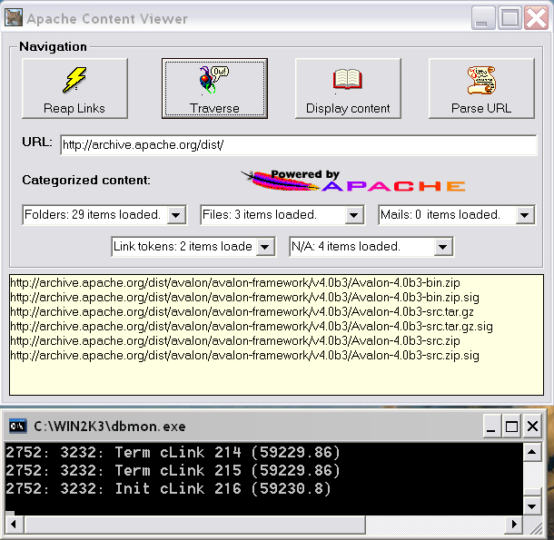



## Wininet\.dll wrapper with sample application \(ACV v\.0\.0\.1\.\)

### Description

Almost complete wininet.dll wrapper with sample application.
 
### More Info
 

             |
---                |---
**Submitted On**   |2005-09-07 15:40:18
**By**             |[Petar Atanasov](https://github.com/Planet-Source-Code/PSCIndex/blob/master/ByAuthor/petar-atanasov.md)
**Level**          |Intermediate
**User Rating**    |5.0 (30 globes from 6 users)
**Compatibility**  |VB 6\.0
**Category**       |[Complete Applications](https://github.com/Planet-Source-Code/PSCIndex/blob/master/ByCategory/complete-applications__1-27.md)
**World**          |[Visual Basic](https://github.com/Planet-Source-Code/PSCIndex/blob/master/ByWorld/visual-basic.md)
**Archive File**   |[Wininet\_dl193073982005\.zip](https://github.com/Planet-Source-Code/petar-atanasov-wininet-dll-wrapper-with-sample-application-acv-v-0-0-1__1-62481/archive/master.zip)

